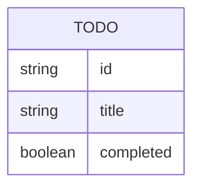

# Domain Model

A single entity, held entirely in memory by `todo-api` and shared by every
visitor — there are no accounts to partition it by.

`Todo.id` is assigned by the API when a todo is created. `title` is required,
non-empty text; `completed` defaults to `false` and is flipped by the
complete/reopen action.